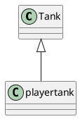

# node环境中搭建ts 学习环境

# 安装TypeScript

tsc index.ts 使用tsc全局命令 编译


默认情况下 TS会做出下面几种假设

1. 假设当前的执行环境是dom 
2. 如果代码中没有使用模块化语句（import export）,便会认为改代码是全局执行的
3. 编译目标代码是ES3
有2种方式更改以上假设

1. 使用tsc命令行的时候加上一些选项参数
2. 使用ts配置文件来更改变异选项

# ts配置文件添加

有2种办法，

1. 自己创建文件 tsconfig.json
2. 使用命令行 tsc --init 它会帮我们生成这个文件

使用了配置文件后，使用tsc进行编译时，不能跟上文件名，如果跟上就会忽略配置文件

# @types/node

@type 是一个ts官方的类型库，其中包含了很多对js代码的类型描述。

因为我们是要在node环境下学习所以要安装@types/node这个库

# 使用第三方库简化流程

ts-node: 将ts代码在内存中完成编译，同时完成运行

ts-node src/index.ts

nodemon: 用于监控文件的变化 

<!-- nodemon --exec ts-node src/index.ts
 -->

 nodemon --watch src -e ts --exec ts-node src/index.ts

# 基本类型约束

## 如何进行类型约束

仅需要在，变量，函数的参数，函数的返回值位置加上 ```:类型```

ts 可以进行类型推导

> 小技巧，如何区分数字字符串和数字，关键看如何读


## 源代码和编译结果的差异

编译结果中没有类型信息


# 基本类型

- number :数字
- string :字符串
- boolean :布尔
- 数组:
- object:对象
- null 和 undefined


null 和 undefined是所有类型的其它子类型

  
通过在配置文件中配置   "strictNullChecks": true 得到更加严格的类型检测


- 联合类型 : 多种类型任选其一

配合类型保护进行判断

类型保护：当对某个变量进行类型判断之后，在判断语句中便可以确定它的确切类型
typeof可以触发简单类型保护

``` let name:string|undefined = undefined ```

- viod类型：通常用于约束函数的返回值，表示该函数没有任何返回

- never类型 : 通常用于约束函数的返回值，表示该函数永远不可能结束

- 字面量类型 : 表示使用一个值进行约束 ``` let c:'A' ```

- 元祖类型（Tuple）:一个固定长度的数组，并且数组中每一项的类型确定

```let tu:[string,number]```

- any 类型 :any类型可以绕过类型检测，因此，any类型的数据是可以赋值给任何类型

# 2021/4/8
# 类型别名 ~~

对已知的一些类型定义名称

```
type 类型名字 = {

}
eg:    

type User = {
    name:string
    gender:'男'|'女'
    age:number
}

```

# 函数的相关约束 ~~
 
## 函数重载
 就是在函数实现前，对函数调用的多种情况进行声名

## 可选参数
 就是可以在某一些参数名后面加上问号，表示该参数可以不用传递，可选参数必须出现在函数的末尾

# 扩展类型-枚举 ~~

扩展类型又：类型别名 枚举  接口  类

枚举通常用于约束某个变量的取值范围。

字面量和联合类型配合使用，也可以达到同样的目标。

### 字面量类型的问题

- 在类型约束位置，会产生重复代码。可以使用类型别名解决该问题

- 逻辑含义和真实的值产生了混淆，会导致当修改真实值的时候，会产生大量修改

- 字面量类型不会进入到编译结果

所以这些问题需要 通过枚举来解决这些问题

### 枚举

如何定义一个枚举 

```
enum 枚举名{
    枚举字段1 = 值1,
    枚举字段2 = 值2,
}
```
枚举会表现在编译结果中，编译结果是一个对象

- 枚举的字段值可以是数字或字符串
- 数字枚举的值会自动自增
- 被数字枚举约束的变量，可以直接赋值为数字
- 数字枚举和字符串枚举编译的结果是有差异的

最佳实践：

- 尽量不要在一个枚举中即出现字符串，又出现数字字段
- 使用枚举时，尽量使用枚举字段的名称，不要使用真实的值


## 扩展知识：位枚举（枚举的位运算，争对数字枚举的）

# 模块化 ~~

tsconfig相关配置

|      配置名称      |       含义                   |
|————————————————————|—————————————————————————————|
|     module         | 设置编译结果中使用的模块化标准 |
| moduleResolution   |   设置解析模块的模式          |
| noImplicitUseStrict|  编译结果中不包含“use strict” |
|  removeComments    |   编译结果移除注释            |
|  noEmitOnError     |    错误时不生成编译结果       |
|  esModuleInterop   | 启用es模块化交互非es模块导出   |


> 前端领域中的模块化标准：ES6 commonjs amd  umd  system

##  TS如何书写模块化语句

TS，中导入和导出模块，统一使用ES6的模块化标准

#  编译结果中的模块化

# 如何在ts中使用commonjs导入导出
使用 export = {

} 这样的语法导出

用 import name  = require()  导入

# 模块解析

模块解析：应该从什么位置寻找模块

TS中，有两种模块解析策略

- classic: 经典解析  现在基本不用了
- node: node解析策略（唯一变化，是将js替换成ts）


# 接口 interface 和类型兼容性 ~~

> 扩展类型：类型别名，枚举，接口，类

typescript的接口：用于约束类，对象，函数的锲约（标准）

契约的形式:
- API文档，弱标准
- 代码约束，强标准

### 接口的的使用

1. 接口约束对象

定义一个接口
```
interface User {
    name:string,
    age:number
}
```

和类型别名一样不会出现在编译结果

2. 接口约束函数


**接口可以继承**

可以通过接口之间的继承，实现多种接口的组合

使用类型别名可以实现类似的组合效果，需要通过 & ，它叫做交叉类型

它们的区别

- 子接口不能覆盖父接口的成员

- 类型别名交叉类型，会把相同成员的类型进行交叉


**readonly**

只读修饰符 ，修饰的目标是只读的不能修改

只读修饰符，不在编译结果中


# 类型兼容性

B->A， 如果能完成赋值，则B和A类型兼容


鸭子辨型法（子结构辨型法）: 目标类型需要某一些特征，赋值的类型只要能满足改特征即可

- 基本类型 ： 完全匹配

- 对象类型：鸭子辨型法


类型断言
as 关键字
sound:'gagaga' as 'gagaga'

当直接使用对象字面量赋值时会使用更加严格的判断，多余的属性就会报错

- 函数类型

参数：传递的目标函数参数可以少不可以多

# TS中的类

> 面向对象思想

**属性**

使用属性列表来描述这个属性
```
class  User {
    name:string //属性列表
    age:number //属性列表
    constructor(name:string,age:number){
        this.name = name;
        this.age = age;
    }
}

```
**属性的初始化检查**

   
``` "strictPropertyInitialization": true```

属性的初始化位置：

1. 构造函数中
2. 属性默认值

**属性可以修饰为可选的**
**属性可以修饰只读**

**使用访问修饰符**

访问修饰符可以控制类中的某个成员的访问权限

- public:默认的访问修饰符，公开的，所有的代码都可以访问
- private：私有的只有在类中才能访问
- protected:

**属性简写**

如果某个属性，通过构造函数的参数传递，并且不做任何处理的赋值给该属性。
可以进行简写

就是在属性前面添加一个修饰符

**访问器**

作用：用于控制属性的读取和赋值

set get 方法 

#  泛型 ~~

**在函数中使用泛型**

有时，书写某个函数时，会丢失一些类型的信息（多个位置的类型因该保持一致或有关联的信息）

泛型：是指附属于函数，类，接口，类型别名上的类型

泛型相当于是一个类型变量，在定义时，无法预先知道具体类型

很多时候，TS会智能的根据传递的参数，推导出泛型的具体类型

泛型可以设置默认值
在函数名之后写上```<泛型名称>```

**如何在类型别名，接口，类中使用泛型**

直接在名称后写上```<泛型名称>```


# 泛型约束

泛型约束，用于限制泛型取值

就是 T extend 接口

# 多泛型


# TS进阶 ~~
### 深入理解类和接口

# 面向对象概述 ~~

1. 为什么要讲面向对象
    答。 TS为前端面向对象开发带来了契机
    js语言没有类型检查，如果使用面向对象的开发方式，会产生大量的接口
    而大量的接口会导致调用复杂度剧增，这种复杂度必须通过严格的类型检查来避免错误，尽管可以通过注释。文档或记忆力，但是它们没有强的约束力。

    TS带来了完整的类型系统，因此开发复杂程序时，无论接口数量有多少，都可以获得完整的类型检查，并且这种检查是具有强约束力的。

2. 面向对象中有许多非常成熟的模式，能处理复杂问题

在过去的很多年中，在大型应用或复杂的领域，面向对象已经积累了非常多的经验

nest.js: 相当于是前端的java spring

typeorm:orm框架  

## 什么是面向对象

面向对象：Oriented(基于) Object ，简称OO。

- 是一种编程思想，它提出一切以对象切入点思考问题

其它的编程思想：面向过程，函数式编程


开发最重要最难的是什么？思维

面向过程：以功能流程为思考点，不太适合大型应用


函数式编程：以数学运算为思考切入点

面向对象：以划分类为思考切入点


类：可以产生对象的模板。

1. TS中的OOP（面向对象编程，Oriented object Programing）
2. 小游戏练习

# 类的继承 ~~



# 重写 重写继承父类的属性和方法

重写：子类中覆盖父类的成员

子类成员不能改变父类成员的类型

无论是属性还是方法，子类都可以对父类的相应成员进行重写，但是重写时，需要保证类型的匹配。

注意this关键字：在继承关系中，this的指向是动态-调用方法时，更具具体的调用者确定this指向

子类的对象，始终可以赋值给父类

面向对象中，这种现象叫做里氏替换原则

## protected 修饰符

protected: 受保护的成员，只能在自身或者子类里面访问


super 在子类中的方法中可以使用super关键字读取父类的成员


## 继承的单根性和传递性


单根性  每个类最多只能有一个父类


传递性：如果A是B的父类并且B是C的父类则可以认为A也是C的父类


# 抽象类

```js
abstract class Chess{
    x:number = 0;
    y:number = 0;
    abstract readonly name:string ;
    abstract move():boolean
}
```

有时某个类只表示抽象的概念，主要用于提取子类共有的成员，而不能直接创建对象，该类可以作为抽象类


给类前面加abstract


# 抽象成员

父类中，可能知道有些成员是必须存在的，但是不知道该成员的值或实现是什么，因此，需要有一种强约束，让继承该类的子类必须要实现该成员

## 设计模式 - 模板模式

有些方法，所有的子类实现的流程完全一致，只是流程中的某个步骤的具体实现不一致
可以将该方法提取到父类在父类中完成整个流程的实现，遇到实现不一致的方法时，将该方法做成抽象方法

# 静态成员

## 什么是静态成员

静态成员是指，附着在类上的成员（属于某个构造函数的成员）

static 关键字

## 设计模式 - 单例模式

单例模式：某些类的对象，在系统中最多只能有一个，为了避免开发者照成随意创建多个类的对象的错误，可以使用单例模式


# 再谈接口

接口用于约束类，对象，函数，是一个类型契约

不使用接口时
- 对能力（成员函数）没有强约束力
- 容易将类型和能力耦合在一起

系统中缺少对能力的定义  ----接口

面向对象领域中的接口的意义，表达了某个类是否有某种能力


类型保护函数

```js

function hasFireShow(ani:object):ani is IFireShow {
    if((ani as IFireShow).singleFire && (ani as IFireShow).doubbleFire){
        return true;
    }

    return false;
}
```


# 索引器

```对象[值]```

TS不会对这个做严格的类型检测 如果需要
要开启配置  ```noImplicitAny``` 开启对隐式的检测

# TS中的this

配置 noImplicitThis为true，不允许this的隐式类型为any

在TS中，允许在书写函数时，手动声明该函数中this的指向，将this作为第一个参数，该参数只用于约束this